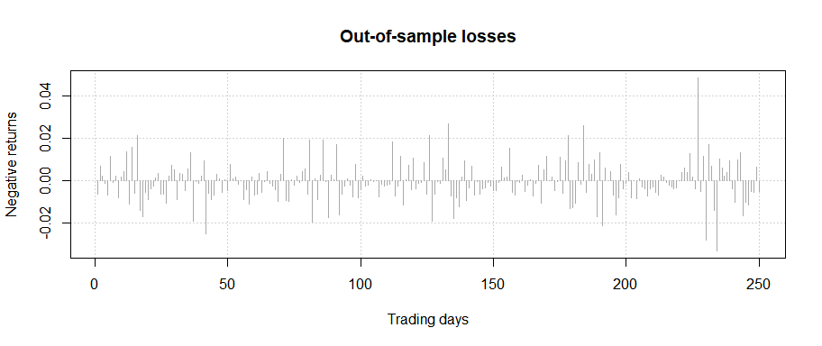
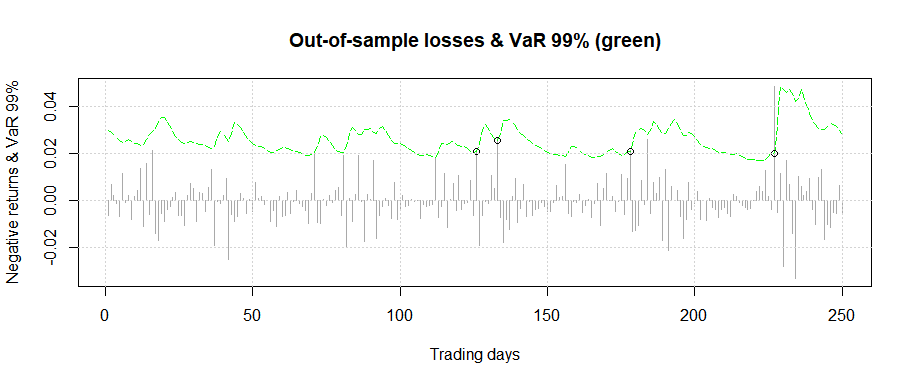

<!-- README.md is generated from README.Rmd. Please edit that file -->

# ufRisk

<!-- badges: start -->

[](https://CRAN.R-project.org/package=ufRisk)
[](https://lifecycle.r-lib.org/articles/stages.html#stable)
<!-- badges: end -->

The goal of `ufRisk` is to enable the user to compute one-step ahead
forecasts of Value at Risk (VaR) and Expected Shortfall (ES) by means of
various parametric and semiparametric GARCH-type models. For the latter
the estimation of the nonparametric scale function is carried out by
means of a data-driven smoothing approach. Currently the GARCH, the
exponential GARCH (EGARCH), the Log-GARCH, the asymmetric power ARCH
(APARCH), the FIGARCH and FI-Log-GARCH can be employed within the scope
of `ufRisk`. Model quality, in terms of forecasting VaR and ES, can be
assessed by means of various backtesting methods.

## Installation

You can install the released version of ufRisk from
[CRAN](https://CRAN.R-project.org) with:

``` r
install.packages("ufRisk")
```

## Example

The data set `ESTX`, which is implemented in the `ufRisk` package,
contains daily financial data of the EURO STOXX 50 (ESTX) index from
April 2007 to December 2021. In the following an example of the
(out-of-sample) one-step forecasts of the 97.5%-VaR (red line) and the
corresponding ES (green line) as well as the 99%-VaR (green line), which
are obtained by employing a FIGARCH model to the `ESTX` return series,
are illustrated. Exceedances are indicated by the colored circles.

``` r
# Applying the FIGARCH model to the ESTX return series
x = ESTX$price.close
results = varcast(x, model = 'fiGARCH', a.v = 0.99, a.e = 0.975, n.out = 250)
```

------------------------------------------------------------------------

**Visualize your results by means of the implemented plot method**

Plotting the out-of-sample loss series:

``` r
plot(results, plot.option = 1)
```



Plotting the out-of-sample loss series, VaR.v & breaches:

``` r
plot(results, plot.option = 2) 
```



Plotting the out-of-sample loss series, VaR.e, ES & breaches:

``` r
plot(results, plot.option = 3) 
```


------------------------------------------------------------------------

Assess the quality of your model by employing various backtesting
methods by means of the functions `trafftest`, `covtest` and `lossfunc`.

**Conduct a traffic light test for VaR and ES**

``` r
trafftest(results)
#>  
#> ###################################
#> #       Backtesting results       #
#> ###################################
#>  
#> # Traffic light zone boundaries #
#>  Zone         Probability      
#>  Green zone:  p < 95%          
#>  Yellow zone: 95% <= p < 99.99%
#>  Red zone:    p >= 99.99%      
#>  
#> # Test 1: 99%-VaR #
#>  Number of violations: 3
#>  p = 0.7581: Green zone
#>  
#> # Test 2: 97.5%-VaR #
#>  Number of violations: 9
#>  p = 0.9005: Green zone
#>  
#> # Test 3: 97.5%-ES #
#>  Number of weighted violations: 4.7459
#>  p = 0.8715: Green zone
#>  
#> # Weighted Absolute Deviation #
#>  WAD = 1.1587
```

------------------------------------------------------------------------

**Conduct a conditional and unconditional coverage test as well as an
independence test**

``` r
covtest(results)
#>  
#> ##################################
#> #          Test results          #
#> ##################################
#>  
#> # Unconditional coverage test #
#>  
#> H0: w = 0.99
#> p_[uc] = 0.753
#>  
#> # Independence test #
#>  
#> H0: w_[00] = w[10]
#> p_[ind] = 0.7868
#>  
#> # Conditional coverage test #
#>  
#> H0: w_[00] = w_[10] = 0.99
#> p_[cc] = 0.9175
```

------------------------------------------------------------------------

**Calculate different loss functions**

``` r
lossfunc(results)
#> Please note that the following results are multiplied with 10000.
#> 
#> $lossfunc1
#> [1] 7.411243
#> 
#> $lossfunc2
#> [1] 14.1705
#> 
#> $lossfunc3
#> [1] 14.39198
#> 
#> $lossfunc4
#> [1] 13.44642
```

------------------------------------------------------------------------

## Functions

In `ufRisk` four functions are available.

**Original functions since version 1.0.0:**

-   `covtest`: Coverage tests
-   `lossfunc`: Calculation of loss functions
-   `trafftest`: Traffic light tests for VaR and ES
-   `varcast`: One-step ahead forecasting of VaR and ES

For further information on each of the functions, we refer the user to
the manual or the package documentation.

------------------------------------------------------------------------

## Data Sets

-   `ESTX`: Daily financial time series data of the EURO STOXX 50 Index
    (ESTX) from April 2007 to December 2021
-   `WMT`: Daily financial time series data of Walmart Inc. (WMT) from
    January 2000 to December 2021
